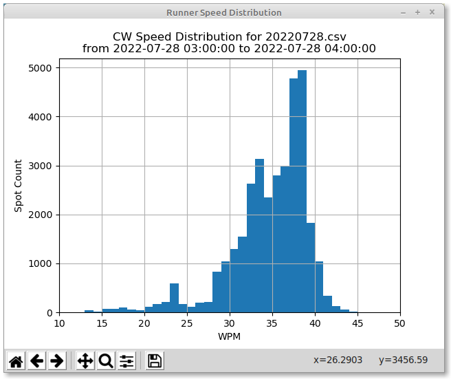

# RBN Analysis Tool

Tool to analyze the spot data from the Reverse Beacon Network.  I originally developed this because I was interested in where I was being heard.  Like all the other apps in this repository, this is a work in progress.

Example usage - To see where I was being heard while running during one of the recent CWTs (0300 session on July 28, 2022), first download the data for that day from https://www.reversebeacon.net/raw_data/ and then run
                                                
rbn_tool.py 20220728.csv -t1 3 -hours 1 -na

-t1 specifies the start time in hours UTC
-hours specifies the duration of the interval of interest
-na filters spots to only those in North America 

The white blobs are all the skimmers that reported spots during that interval.
The Orange blob is my QTH in DM12.
The red x's indicate the skimmers that spotted me on 20m.
The blue +'s indicate the skimmers that spotted me on 40m.

Inspired by some results presented recently by N3QE on the CWops email reflector, I've added a second plot showing the speed distribution of the spots in this time interval:

Contests spanning multiple days are handled by specifying multiple spot files.  To see the speed distribution from this year's NAQP CW contest:

rbn_tool.py 2022080[67].zip -t1 18 -hours 12 -na

Here is the speed distribution for the recent IARU HF Championships:

rbn_tool.py 20220709.zip 20220710.zip -t1 12 -hours 24 -na

# Installation under Linux:

1) Uses python3
2) Clone gitub rbn_tool, libs and data repositories
    - cd
    - mkdir Python
    - cd Python
    - git clone https://github.com/aa2il/rbn_tool
    - git clone https://github.com/aa2il/libs
    - git clone https://github.com/aa2il/data
3) Install packages needed for rbn_tool:
   - cd ~/Python/rbn_tool
   - pip3 install -r requirements.txt
4) Make sure its executable:
   - chmod +x rbn_tool.py 
5) Set PYTHON PATH so os can find libraries:
   - Under tcsh:      setenv PYTHONPATH $HOME/Python/libs
   - Under bash:      export PYTHONPATH="$HOME/Python/libs"
6) Bombs away:
   - ./rbn_tool.py

# Installation under Mini-conda:

0) Good video:  https://www.youtube.com/watch?v=23aQdrS58e0&t=552s

1) Point browser to https://docs.conda.io/en/latest/miniconda.html
2) Download and install latest & greatest Mini-conda for your particular OS:
   - I used the bash installer for linux
   - As of July 2023: Conda 23.5.2 Python 3.11.3 released July 13, 2023
   - cd ~/Downloads
   - bash Miniconda3-latest-Linux-x86_64.sh
   - Follow the prompts

   - If you'd prefer that conda's base environment not be activated on startup, 
      set the auto_activate_base parameter to false: 

      conda config --set auto_activate_base false

   - To get it to work under tcsh:
       - bash
       - conda init tcsh
       - This creates ~/.tcshrc - move its contents to .cshrc if need be
       - relaunch tcsh and all should be fine!
       - Test with:
           - conda list

3) Create a working enviroment for ham radio stuff:
   - Check which python version we have:
       - conda list   
   - conda create --name aa2il python=3.11

   - To activate this environment, use:
       - conda activate aa2il
   - To deactivate an active environment, use:
       - conda deactivate

   - conda env list
   - conda activate aa2il

4) Clone gitub rbn_tool, libs and data repositories:
    - cd
    - mkdir Python
    - cd Python
    - git clone https://github.com/aa2il/rbn_tool
    - git clone https://github.com/aa2il/libs
    - git clone https://github.com/aa2il/data

5) Install packages needed by rbn_tool:
   - conda activate aa2il
   - cd ~/Python/rbn_tool
   - pip3 install -r requirements.txt

6) Set PYTHON PATH so os can find libraries:
   - Under tcsh:      setenv PYTHONPATH $HOME/Python/libs
   - Under bash:      export PYTHONPATH="$HOME/Python/libs"

7) To run rbn_tool, we need to specify python interpreter so it doesn't run in
   the default system environment:
   - cd ~/Python/rbn_tool
   - conda activate aa2il
   - python rbn_tool.py --help

8) Known issues using this (as of July 2023):
   - None

# Installation for Windoz:

1) Best bet is to use mini-conda and follow the instructions above.
2) If you want/need a windoz binary, email me and I'll put one together for you.

